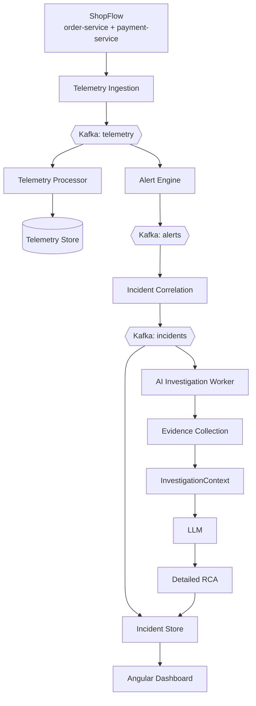

# PulseOps — AI-Powered Incident Intelligence & Reliability Platform

PulseOps watches a small distributed demo application (**ShopFlow**), detects abnormal behaviour,
correlates related alerts into incidents, and **automatically** investigates each incident with an
LLM — without ever handing the model direct access to the database, Kafka, or source control.

```
Incident → Evidence Collection → structured InvestigationContext → LLM → detailed RCA
```

That constraint is the point of the project. The platform does the retrieval; the model only reasons
over the evidence it is given.

---

## Status

| Phase | Scope | State |
|---|---|---|
| 1 | Repo, Docker Compose (Kafka + PostgreSQL), Flyway schema | Done |
| 2 | ShopFlow order + payment services, telemetry, failure injection | Done |
| 3 | Telemetry ingestion → Kafka → Telemetry Processor → store | Done |
| 4 | Alert Engine (deterministic rules) | Done |
| 5 | Incident Correlation + Incident Store | Done |
| 6 | Service Catalog, deployments, PRs, local Git provider | Done |
| 7 | AI Investigation Worker, evidence providers, RCA | Done |
| 8 | Angular dashboard | Next |
| 9 | Dockerfiles for every application | Not started |
| 10 | Azure Container Apps deployment | Not started |

---

## Architecture at a glance



The Telemetry Processor and Alert Engine read the same `telemetry` topic through **separate consumer
groups**. The Alert Engine never waits for telemetry to be written to PostgreSQL. The same applies to
the Incident Store and the AI Investigation Worker on the `incidents` topic.

---

## Prerequisites

| Tool | Version | Notes |
|---|---|---|
| JDK | 21 | `JAVA_HOME` must be set |
| Maven | — | Not required; use the bundled `./mvnw` wrapper |
| Node.js | 20+ | For the Angular dashboard |
| Docker Desktop | — | Must be **running** before `docker compose up` |

---

## Quick start

```powershell
# 1. Configuration
Copy-Item .env.example .env

# 2. Infrastructure (Kafka + PostgreSQL + topic creation)
docker compose up -d

# 3. Build the backend
.\mvnw.cmd clean install

# 4. Run the API (applies Flyway migrations on startup)
.\mvnw.cmd -pl backend/pulseops-api spring-boot:run

# 5. Run the worker (Kafka consumers)
.\mvnw.cmd -pl backend/pulseops-worker spring-boot:run          # port 8084

# 6. Run ShopFlow (separate terminals)
.\mvnw.cmd -pl backend/shopflow-payment-service spring-boot:run   # port 8083
.\mvnw.cmd -pl backend/shopflow-order-service spring-boot:run     # port 8082
```

### Drive the demo

```powershell
# Steady background load
.\scripts\generate-traffic.ps1 -DurationSeconds 300 -RequestsPerSecond 4

# Degrade the payment provider, then restore it
.\scripts\inject-failure.ps1 -ErrorRate 50 -LatencyMs 2000
.\scripts\inject-failure.ps1 -Reset
```

| Service | Port |
|---|---|
| pulseops-api | 8081 |
| shopflow-order-service | 8082 |
| shopflow-payment-service | 8083 |
| pulseops-worker | 8084 |

**Start pulseops-api first** — it is the only process that runs Flyway migrations.

### REST API

| Endpoint | Returns |
|---|---|
| `GET /api/incidents` | Incident summaries, newest first |
| `GET /api/incidents/{key}` | Incident plus its alerts and timeline |
| `GET /api/incidents/{key}/timeline` | Correlation timeline |
| `GET /api/incidents/{key}/alerts` | Alerts belonging to the incident |
| `GET /api/alerts` | Recent alerts |
| `GET /api/services` | Service catalog with dependency edges |
| `GET /api/services/{name}` | One service |
| `GET /api/incidents/{key}/rca` | Current analysis, plus every past attempt |
| `POST /api/telemetry` | Telemetry ingestion (202 Accepted) |

### Automated investigation

Investigations are triggered by incident events, never by a user — there is no "Investigate" button.

| Behaviour | Where |
|---|---|
| Debounce (one investigation per burst of incident updates) | `pulseops.investigation.debounce` |
| Bounded retry while the Incident Store catches up | `max-state-load-attempts`, `state-load-backoff` |
| RCA lifecycle `NOT_STARTED → IN_PROGRESS → COMPLETED → STALE` | `AiInvestigationWorker` + `InvestigationStore` |

With **no** `LLM_API_KEY`, a deterministic rule-based provider runs and nothing leaves the machine.
Setting `LLM_API_KEY` switches the same pipeline onto an OpenAI-compatible model with no code change.

### Azure OpenAI

Verified against `gpt-5` and `gpt-4.1-mini` deployments. Put real values in `.env` (gitignored), never `.env.example`:

| Variable | Value |
|---|---|
| `LLM_BASE_URL` | `https://<resource>.openai.azure.com/openai/v1` — the `/openai/v1` suffix is required |
| `LLM_MODEL` | the **deployment** name, not the model name |
| `LLM_AUTH_HEADER` | `bearer` (works on the v1 endpoint) or `api-key` |

```powershell
. .\scripts\load-env.ps1   # loads .env, masks secrets when printing
```

Reasoning models (`gpt-5*`, `o*`) are detected by name and handled differently: they receive
`max_completion_tokens` instead of `max_tokens`, no `temperature`, and a much larger token budget.
A measured `gpt-5` RCA used **6,489 completion tokens, 3,840 of them reasoning** — leaving roughly
2,650 visible. That number sets the non-reasoning budget too: a model like `gpt-4.1-mini` spends
nothing on reasoning, so its 4,000-token budget has to cover the whole RCA.

Switching models is a one-line `.env` change; the parameter differences are inferred from the name.
Override with `LLM_REASONING_MODEL=true|false` if a deployment is named after a different family
than the model it serves.

Measured on the same incident, with the same evidence package (4 alerts, 2 code snippets, 1 PR):

| | `gpt-5` | `gpt-4.1-mini` |
|---|---|---|
| Wall clock | 57.4s | 17.6s |
| Completion tokens | 6,489 (3,840 reasoning) | 1,720 (0 reasoning) |
| Confidence | 0.72 | 0.70 |
| Files cited | 2 | 2 (the same two) |

Both separated the trigger (external provider 503s) from the amplifier (PR #482 raising the provider
read-timeout to 5s). `gpt-5` reasoned in more depth and listed more uncertainties; `gpt-4.1-mini` is
roughly 3x faster and far cheaper for the same conclusion, so it is the default.

Verify:

```powershell
# Topics exist
docker exec pulseops-kafka /opt/kafka/bin/kafka-topics.sh --bootstrap-server localhost:9092 --list

# Schema was migrated
docker exec pulseops-postgres psql -U pulseops -d pulseops -c '\dt'

# API is up
curl http://localhost:8081/actuator/health
```

---

## Dashboard

Angular 20, standalone components, one lazy chunk per page.

```powershell
cd frontend/pulseops-web
npm install
npm start          # http://localhost:4200
```

The browser never calls the API cross-origin. `proxy.conf.json` forwards `/api` to port 8081 in
development, so there is no CORS configuration to maintain and no port baked into the client.

The API base URL is read at runtime from `public/config.js`, not from a build-time environment file.
One built artifact can therefore be promoted between environments, which is what the container image
in Phase 9 needs; an `environment.ts` would force a rebuild per environment.

| Page | Shows |
|---|---|
| Dashboard | open/critical counts, services, recent incidents and alerts |
| Incidents | filterable table by status |
| Incident | the full investigation (below) |
| Services | the dependency graph the correlation engine walks |

The incident page has **no "Investigate" button**. The investigation is triggered by the incident
pipeline, so the page polls instead — every 5s while an investigation is running, every 20s once it
settles. It keeps polling after completion because a live incident can pick up new alerts and be
re-investigated while someone is reading it. Verified end to end: the page moved from a spinner to a
70%-confidence RCA without any interaction.

`/api/incidents/{key}/telemetry` reuses the worker's `TelemetrySummarizer` over the same window
rather than recomputing. The figures on screen are the figures the model reasoned about; a second
implementation would eventually disagree with the first and the page would misrepresent the analysis.

---

## Containerisation concepts used here

This project doubles as a demonstration of container fundamentals, so the vocabulary matters:

| Term | Meaning | Where it shows up |
|---|---|---|
| **Docker image** | An immutable, packaged application blueprint — filesystem plus the command to start it. Built once, never modified. | `postgres:16-alpine`, `apache/kafka:3.8.0`, and later `pulseops-api` built from a multi-stage Dockerfile |
| **Docker container** | A running instance of an image. Many containers can run from one image; deleting a container does not delete the image. | `pulseops-postgres`, `pulseops-kafka` |
| **Docker volume** | Storage that outlives the container. Without it, restarting Postgres would lose the database. | `postgres-data`, `kafka-data` |
| **Docker Compose** | A tool for declaring and running a set of containers together, including their network, startup order and health checks. | `docker-compose.yml` |
| **Azure Container Registry (ACR)** | A private registry that *stores* images. The cloud equivalent of your local image cache. | Phase 10 |
| **Azure Container Apps (ACA)** | A managed Azure service that *runs* containers pulled from a registry, without you managing servers or Kubernetes. | Phase 10 |

The mental model: **Compose runs images locally → ACR stores those same images → ACA runs them in Azure.**
The application binary is identical in all three places; only environment variables change.

### Why localhost is never hardcoded

Inside Compose, containers reach each other by **service name** (`postgres:5432`, `kafka:9092`).
From your host, the same services are reachable on `localhost`. In Azure they are fully qualified
managed endpoints. Every connection target therefore comes from an environment variable
(`POSTGRES_HOST`, `KAFKA_BOOTSTRAP_SERVERS`) with a local-friendly default.

### Why Kafka has two listeners

A Kafka broker tells clients where to reach it via *advertised listeners*. A single advertised
address cannot be correct for both a container (`kafka:9092`) and your host (`localhost:9092`), so
the broker advertises both on separate listeners, and Compose maps host port `9092` to the
host-facing listener.

---

## Repository layout

```
pulseops/
├── backend/
│   ├── pulseops-domain/           event contracts and enums, no Spring
│   ├── pulseops-infrastructure/   JPA entities, repositories, Flyway migrations, Kafka wiring
│   ├── pulseops-api/              telemetry ingestion, Incident Store, REST API
│   ├── pulseops-worker/           telemetry processor, alert engine, correlation, AI worker
│   ├── shopflow-order-service/    demo app
│   └── shopflow-payment-service/  demo app (supports failure injection)
├── frontend/pulseops-web/         Angular dashboard
├── infrastructure/
│   ├── kafka/init-topics.sh       creates all topics on `docker compose up`
│   └── postgres/init/             extensions only; Flyway owns the schema
├── docs/
├── docker-compose.yml
├── pom.xml
└── README.md
```

### Who owns the schema

All Flyway migrations live in `pulseops-infrastructure` and are executed by **`pulseops-api` only**.
Every other service sets `spring.flyway.enabled=false`. One migrator avoids concurrent-migration
locking and makes the ordering obvious: start the API first.

---

## Safety

AI output is **advisory**. PulseOps may recommend a rollback, a timeout change, or a provider
investigation, but it never executes remediation. No credentials are stored in source; everything
sensitive comes from environment variables or Azure secrets.
