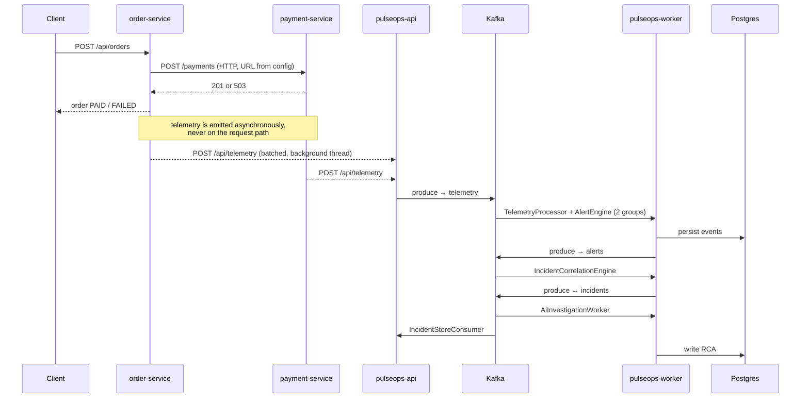
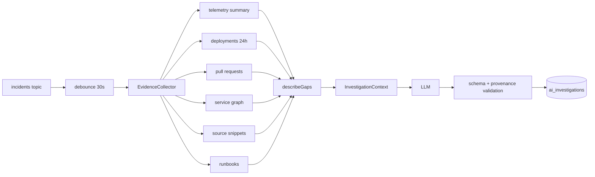

# PulseOps — Architecture Overview

An AI-assisted incident investigation platform. It watches a small e-commerce system,
detects when it degrades, groups the symptoms into a single incident, and produces a
root-cause analysis grounded in evidence it actually collected.

This document is the reading guide: what the system does, how the pieces connect, why
each design decision was made, and — importantly — where the limits are.

---

## 1. The problem

When a service degrades, an on-call engineer gets paged with a symptom ("error rate above
20%") and has to answer a different question: *what changed, and where is the real fault?*
That work is mostly mechanical — check dependencies, check recent deploys, read the diff,
find the runbook — and it is done under time pressure at 3am.

PulseOps automates the mechanical part. It does not try to replace the engineer's judgement;
it tries to hand them the page of evidence they would otherwise spend twenty minutes assembling.

Two things make this interesting beyond "call an LLM":

- **Symptoms are not the cause.** When `payment-service` slows down, `order-service` also
  starts failing. Both fire alerts. They are one incident, not two, and the cause is in the
  dependency, not the caller.
- **An LLM with no evidence just guesses confidently.** The hard part is the retrieval and
  the honesty about what is missing — not the prompt.

## 2. The two halves

The repository contains a system under observation and the system observing it.

| | |
|---|---|
| **ShopFlow** | The demo application being watched: `order-service` (8082) and `payment-service` (8083). It exists to fail realistically and on demand. |
| **PulseOps** | The observability platform: `pulseops-api` (8081), `pulseops-worker` (8084), and an Angular UI (8080 in containers, 4200 in dev). |

Keeping these separate matters. ShopFlow knows nothing about incidents or alerts — it only
emits telemetry, exactly as a real service would. Every PulseOps feature had to work using
only what a real system would actually expose.

### Failure injection

`payment-service` has an internal endpoint that makes it slow and unreliable on demand:

```
POST /internal/failure  {"enabled":true,"errorRate":60,"latencyMs":2500}
```

`errorRate` is an integer percentage (0–100), not a fraction. The injector deliberately
separates *slow* from *failing*, because latency and error-rate propagate through a
dependency chain differently — and distinguishing them is the point of the demo.

This is a pure in-memory toggle: an `AtomicReference<Settings>`. It writes nothing to Kafka
or the database, so it can never be mistaken for real signal.

## 3. Maven module structure

Seven modules under one parent, arranged so dependencies point inward:

```
pulseops-domain            no Spring, no JPA — 3 dependencies total
  └── pulseops-infrastructure   JPA, Kafka, Flyway
        ├── pulseops-api        REST + ingestion + incident store   (8081)
        └── pulseops-worker     processing, alerting, correlation, AI (8084)

shopflow-common            telemetry filters + async publisher
  ├── shopflow-order-service                                        (8082)
  └── shopflow-payment-service                                      (8083)
```

`pulseops-domain` holds the event contracts — the records that cross process boundaries.
It has three dependencies (Jackson annotations, Jakarta validation, SLF4J) and no framework.
That constraint is what makes the same `TelemetryEvent` definition safely shared by a
producer, a consumer, and the REST layer without dragging Spring into the contract.

---

## 4. How things are actually connected

There are exactly **three** wiring mechanisms in this system. Being able to name which one
applies to a given arrow is most of understanding the architecture.

### a. Spring dependency injection — inside one JVM

Constructor injection. `OrderController` → `OrderService` → `PaymentClient`. Compile-time
checked, same process, a direct method call. If the class isn't a bean, the app won't start.

### b. An HTTP URL from configuration — between two services

`order-service` calls `payment-service` because a config value says where it is:

```yaml
shopflow.payment.base-url: ${SHOPFLOW_PAYMENT_BASE_URL:http://localhost:8083}
```

Nothing is compile-time checked here. The only contract is the URL and the JSON shape.
This is the same value that becomes `http://payment:8083` in Docker Compose — the code
does not change between environments, only the configuration does.

### c. A topic name — between a producer and a consumer

The loosest coupling. The producer writes to `"telemetry"`; the consumer reads from
`"telemetry"`. Neither knows the other exists. They don't have to be running at the same
time, and the string constant in `Topics` is the entire contract.

This is why the worker can be restarted mid-demo without losing events, and why adding a
fourth consumer of `incidents` would require changing nothing that already exists.

### The flow, end to end



The critical detail: **telemetry never blocks a user request.** `HttpTelemetryFilter`
measures the request in a `finally` block and hands the measurement to `TelemetryPublisher`,
which offers it to a bounded `ArrayBlockingQueue` drained by a background thread. If the
queue is full, telemetry is dropped. Observability degrades before the product does — that
is the correct trade-off, and it is deliberate.

## 5. Topics and consumer groups

Three primary topics, each with a dead-letter twin:

```
telemetry   alerts   incidents
telemetry.dlq   alerts.dlq   incidents.dlq
```

Five consumer groups:

| Group | Reads | Does |
|---|---|---|
| `pulseops-telemetry-processor` | telemetry | persists events |
| `pulseops-alert-engine` | telemetry | evaluates threshold rules |
| `pulseops-incident-correlation` | alerts | groups alerts into incidents |
| `pulseops-incident-store` | incidents | writes incident state (in the API) |
| `pulseops-ai-investigation` | incidents | runs the RCA (in the worker) |

**Two fan-out points**, and they are the reason for separate groups:

- `telemetry` is read by *two* groups, so every event is delivered to both. Alerting is never
  blocked behind the processor's database writes.
- `incidents` is read by *two* groups, so a slow LLM call can never delay the UI's view of
  incident state.

If these shared a group they would compete for partitions and each event would go to only
one of them. Verified in practice: both `incidents` groups sit at identical offsets.

Partitioning is by a deliberate key. Telemetry is keyed by **service name** so one service's
events stay ordered relative to each other. Incident events are keyed by **incident id** so
all updates to one incident land on one partition and are processed in order.

## 6. Alerting — deliberately deterministic

No machine learning. A sliding window and fixed thresholds:

- window **60s**, minimum **8 samples**, cooldown **90s**
- `payment-service` error rate > **0.20** → CRITICAL
- `payment-service` p95 latency > **2000ms** → MAJOR
- `order-service` error rate > **0.20** → MAJOR

The two guards carry the design reasoning:

- **min-samples** prevents a single failure in a quiet period from reading as a 100% error rate.
- **cooldown** makes one degradation produce one alert, not one per event.

p95 uses the nearest-rank method over the window's samples. Only `HTTP` events feed the rules —
`DEPENDENCY` spans are recorded for causality analysis but would double-count if alerted on.

Determinism here is a feature: alerting must be explainable and reproducible. The AI is applied
to *interpretation*, never to *detection*.

## 7. Correlation — symptoms into one incident

When alerts arrive, the correlation engine decides whether each one opens a new incident or
joins an existing one. Two alerts belong together when they fall within a **10-minute** window
and are related in the service dependency graph.

It then **promotes the primary service**. If `payment-service` and `order-service` are both
alerting and `order-service` depends on `payment-service`, the dependency is named as primary.
That single step is what turns "two services are broken" into "payment-service is broken and
order-service is a victim".

Verified end to end: a 60% / 2500ms injection produced three alerts across two services, and
all three collapsed into one incident with `payment-service` as primary.

### State is carried as full state, not deltas

`IncidentEvent` carries the complete incident, not a diff. Combined with a monotonically
increasing `version`, a consumer can discard a stale event by comparing versions. This makes
the consumer tolerant of duplicates and reordering without any coordination — significantly
simpler than reconstructing state from a delta stream.

## 8. Delivery guarantees

The system is **at-least-once**, and every consumer is written to survive redelivery.

- `acks: all` on the producer.
- `enable-auto-commit: false`, `ack-mode: record` — offsets commit only after successful handling.
- An **idempotency guard**: `processed_events` has a composite primary key of
  `(event_id, consumer_group)`. A consumer claims an event inside the same transaction that
  performs its work; a duplicate fails the claim and is skipped. The claim uses `MANDATORY`
  propagation, so it cannot silently run outside a transaction.
- Errors are split into **retryable** and **non-retryable**. Retryable errors back off
  exponentially (500ms, ×2, capped at 5s); non-retryable ones — malformed payloads that will
  never succeed — go straight to the DLQ instead of poisoning the partition.

Deserialization is deliberately `String`-based rather than using a typed deserializer, so a
malformed message produces a catchable application exception that can be routed to the DLQ,
rather than an error inside the container that is far harder to handle cleanly.

## 9. The AI layer — the important boundary



**The design rule: the LLM never queries anything.** It receives a finished evidence package
and returns structured JSON. It has no database access, no tools, no retrieval of its own.

That boundary buys three things: the inputs are bounded and auditable, the cost is predictable,
and a failure in the model degrades the feature instead of breaking the pipeline.

Supporting decisions:

- **Debounce 30s** — one degradation produces a burst of incident updates; without this the
  system would launch an investigation per update and pay for every one.
- **Telemetry is summarised, not dumped.** `TelemetrySummarizer` caps and aggregates
  (5000 events scanned, 5 groups, 10 samples, 200-char messages) and strips volatile tokens —
  UUIDs, timestamps — via regex so that identical failures collapse into one group instead of
  appearing as thousands of unique messages.
- **`describeGaps()`** explicitly records what could *not* be found, and those gaps are sent
  to the model. A real investigation output includes lines like *"No source code was retrieved;
  conclusions about code are not evidence-backed."* Making absence of evidence explicit is the
  single most important honesty mechanism in the system.
- **Structured output.** `response_format: json_object`, mandatory `why` fields on conclusions,
  and validation on return. A response truncated by the token limit (`finish_reason == "length"`)
  is rejected rather than partially trusted.
- **Offline fallback.** With no API key configured, a deterministic rule-based provider runs
  instead. The demo works with nothing leaving the machine.
- **Source snippets are real.** `LocalGitProvider` reads actual files from disk, with a path
  containment check (`safeResolve`) so a crafted path cannot escape the repository root —
  the obvious path-traversal risk in a feature that reads files by name.

## 10. Data model

16 tables, 10 Flyway migrations, `ddl-auto: validate` everywhere — the schema is owned by
migrations, never by Hibernate. Only `pulseops-api` runs Flyway; the worker validates against
the schema the API created.

Two schema decisions worth explaining:

- **No foreign key from `alerts` to `incidents`.** An alert exists before its incident does,
  and arrives over Kafka with no ordering guarantee relative to incident creation. A FK would
  make correct event processing fail. The link is by `incident_key`, deliberately unenforced.
- **`incident_number` comes from a sequence starting at 1042.** Human-facing incident numbers
  are separate from the internal UUID primary key.

`IncidentEntity` uses `@DynamicUpdate` so concurrent updates touching different columns don't
overwrite each other's work.

## 11. Frontend

Angular 20, standalone components, signals. The UI **polls**; it holds no WebSocket.

- Incident detail polls every **5s** while an RCA is pending, **20s** once it settles.
- The RCA endpoint is explicitly designed to be read-only and poll-friendly.
- If an investigation is `STALE`, the API falls back to the most recent `COMPLETED` one, so
  the user sees a slightly old answer rather than an empty page.

Polling is the right call here: the update rate is seconds, not milliseconds, and it avoids
connection state, reconnect logic, and sticky-session concerns for a demo-scale system.

## 12. Containerisation

Five images. Backend images are multi-stage — a Maven stage builds, a JRE Alpine stage runs —
and each runs as a **non-root** user. Module POMs are copied before sources so dependency
resolution stays cached when only code changes.

Three problems that had to be solved, each worth mentioning:

1. **Source root.** The worker's `PULSEOPS_SOURCE_ROOT` defaults to `../..`, which resolves to
   nothing inside a container — the AI would have silently returned zero code snippets. The
   image carries a read-only copy of the source at an absolute `/app/source`.
2. **Migration ordering.** Only the API runs Flyway, but the worker validates the schema.
   `depends_on: condition: service_healthy` on the API guarantees the schema exists first.
3. **Single origin.** nginx serves the SPA and reverse-proxies `/api`, so the browser sees one
   origin and the application needs no CORS configuration at all. The upstream is rendered at
   container start via `envsubst`, so one image works in every environment.

```
docker compose --profile apps up -d --build
```

Infrastructure alone (the normal development loop, apps from the IDE):

```
docker compose up -d
```

---

## 13. Limitations — read this before an interview

Being precise about what the system does *not* do is more convincing than overselling it.

**Distributed systems**
- At-least-once, not exactly-once. Idempotency makes redelivery safe; it does not make it absent.
- **No transactional outbox.** The alert engine saves to the database and publishes to Kafka as
  two separate operations. A crash between them loses the publish. The correct fix is an outbox
  table drained by a relay.
- **Correlation state is in-memory and single-instance.** Running two worker replicas would
  produce duplicate incidents. Open incidents are restored from the database on startup, which
  covers restart but not horizontal scale.
- DLQ topics exist and are written to, but nothing monitors or replays them.

**AI**
- Confidence is **self-reported by the model**, not a measured accuracy. It should not be read
  as a probability of correctness.
- Evidence quality caps answer quality. The system is honest about gaps, but an investigation
  with no deployment data is still a weak investigation.
- Pull requests are queried twice per investigation — once by the PR provider and again by the
  source-code provider. The six providers also run sequentially when they are independent.

**Demo fidelity**
- Deployments, pull requests and runbooks are **seeded**. Commit SHAs are synthetic, and source
  is read from the working tree, not from Git history at the relevant commit.
- **The demo decays as the database ages.** Seed timestamps are relative to *migration* time, not
  demo time. The deployment evidence lookback is 24 hours, so on a database older than a day the
  seeded deployment falls outside it and the AI silently stops citing deployments, PRs and code —
  with only the `missingEvidence` list hinting why. A fresh deployment is unaffected; on a
  long-lived one run `scripts/refresh-demo-data.ps1` first.

**Production readiness**
- No authentication or authorisation anywhere.
- Demo credentials, PLAINTEXT Kafka, a single broker, and the platform shares a database with
  the application it monitors.
- No pagination on any endpoint; dashboard counts are computed from a fetched subset and are
  wrong beyond the query limit.
- Some dashboard errors are swallowed silently; incident-detail polling stops permanently on
  any error.
- `MITIGATED` and `RESOLVED` states exist but are never set — there is no resolution workflow.

## 14. Questions worth being ready for

- *Why Kafka and not a queue?* Two independent consumers of `telemetry` and two of `incidents`,
  each needing its own copy of every message, plus replay after restart. That is a log, not a queue.
- *Why not have the LLM query the database directly?* Unbounded cost, unauditable inputs, and a
  model failure becomes a pipeline failure. The evidence package makes all three tractable.
- *How do you prevent duplicate processing?* `processed_events` keyed by
  `(event_id, consumer_group)`, claimed in the same transaction as the work.
- *What breaks first under load?* Telemetry publishing — the bounded queue drops events by design.
  After that, the single-instance correlation engine, which cannot be scaled out as written.
- *What would you fix first?* The outbox, then correlation state, then authentication.
